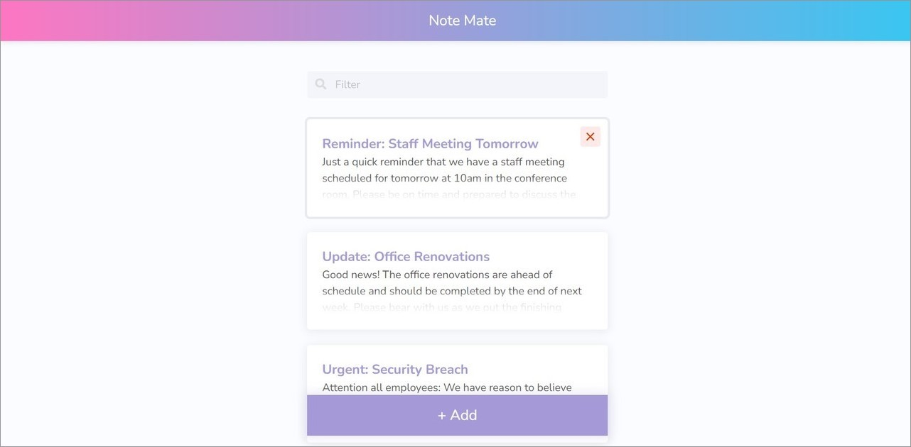
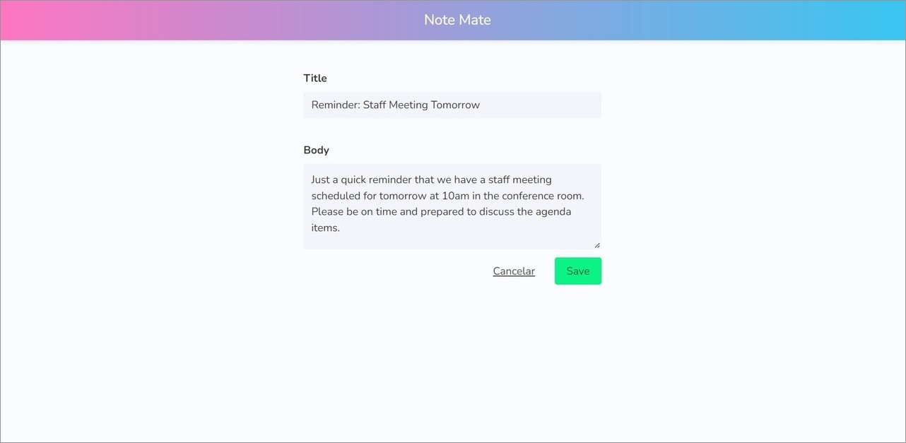
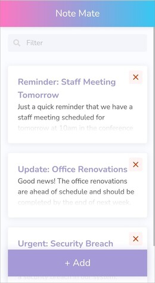
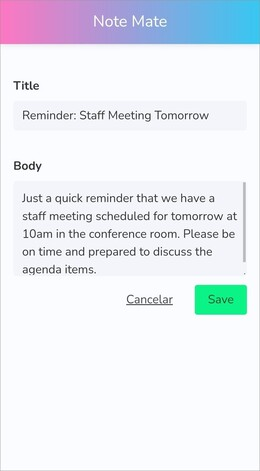

# Proyecto de Notas con Angular

Este es un proyecto de una página web desarrollada con Angular que permite a los usuarios registrar, editar y eliminar notas, cada una con un título y una descripción. La página es responsiva y está en inglés. Para la apariencia visual se utilizó el Framework Bulma y Sass.

## Tecnologías principales
 Angular  
 LocalStorage  
 Bulma  
 Sass  
## Capturas de pantalla

A continuación se presentan capturas de pantalla de la página en desktop y móvil:

## Créditos

Este proyecto fue creado a partir de un video tutorial de YouTube del canal [Devstackr](https://www.youtube.com/channel/UCbwsS1m4Hib6R-9F1alus_A). El tutorial en particular es [Angular Tutorial - Build a CRUD App with Angular 12](https://www.youtube.com/watch?v=gvWxMQ_Zios&list=PLSvtEtsyp826ID5XmG3Y_YFBNswA1NK77&index=1).

## Comparación de tecnologías y características

Una diferencia importante entre el proyecto del video tutorial y este proyecto es que el del video no incluía un método para almacenar las notas, mientras que en este proyecto se utiliza LocalStorage para guardar las notas en el navegador del usuario. Además, se implementa responsividad de la página.

## Enlace
Puedes ver la página web en funcionamiento en el siguiente enlace: [Live site URL](https://notes-yha.netlify.app/).
